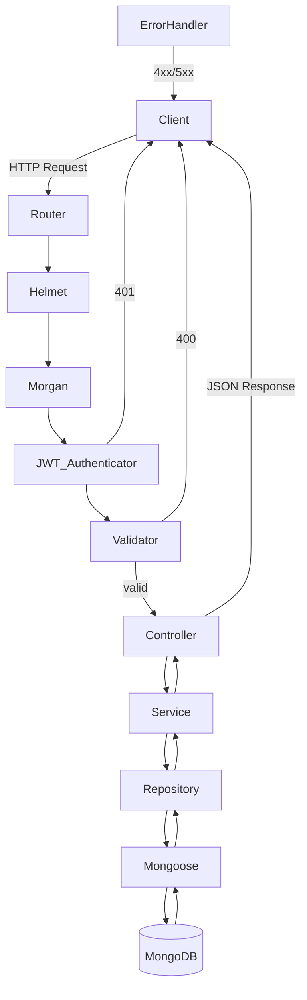

# Design Document: node-express-mongodb-api

## Overview

This document describes the technical design for a RESTful API built with Node.js, Express, TypeScript, and MongoDB (via Mongoose). The API manages six primary resources — Users, ExpenseCategories, PaymentSources, Expenses, Incomes, and Periods — and exposes standard CRUD endpoints protected by JWT authentication. Periods embed their associated expense and income entries as subdocuments rather than storing them in separate collections.

The system follows a layered architecture: Router → Controller → Service → Repository → Mongoose Model. Input validation is handled by Zod middleware before requests reach controllers. A centralized error handler normalizes all error responses.

Key technology choices:
- **Node.js + Express** — HTTP server and routing
- **TypeScript** — static typing throughout
- **MongoDB + Mongoose** — document persistence with automatic `_id`, `createdAt`, `updatedAt`
- **Zod** — schema declaration and request validation
- **jsonwebtoken** — JWT signing and verification
- **bcrypt** — password hashing
- **dotenv** — environment variable loading
- **helmet** — secure HTTP response headers
- **morgan** — HTTP request logging

---

## Architecture

### Layered Request Flow



### Middleware Pipeline (per protected route)

```
Request
  -> helmet() (security headers)
  -> morgan() (request logging)
  -> express.json()
  -> JWT_Authenticator (Bearer token check)
  -> validateBody(zodSchema) or validateObjectId(param)
  -> Controller handler
  -> ErrorHandler (catches thrown errors)
```

### Directory Structure

```
src/
  config/
    env.ts              # env var loading and validation
    db.ts               # Mongoose connection
  models/
    user.model.ts
    expense-category.model.ts
    payment-source.model.ts
    expense.model.ts
    expense-audit.model.ts  # audit trail entries for Expense changes
    income.model.ts
    period.model.ts     # embeds PeriodExpenseEntry and PeriodIncomeEntry subdocuments
    income-audit.model.ts  # audit trail entries for Income changes
  schemas/              # Zod schemas + inferred TS types
    user.schema.ts
    expense-category.schema.ts
    payment-source.schema.ts
    expense.schema.ts
    income.schema.ts
    period.schema.ts    # includes periodExpenseEntrySchema and periodIncomeEntrySchema
  repositories/
    expense-category.repository.ts
    payment-source.repository.ts
    expense.repository.ts
    expense-audit.repository.ts
    income.repository.ts
    income-audit.repository.ts
    period.repository.ts
    user.repository.ts
  services/
    auth.service.ts
    expense-category.service.ts
    payment-source.service.ts
    expense.service.ts
    expense-audit.service.ts  # audit logic lives in expense.service.ts directly
    income.service.ts
    income-audit.service.ts  # audit logic lives in income.service.ts directly
    period.service.ts
  controllers/
    auth.controller.ts
    expense-category.controller.ts
    payment-source.controller.ts
    expense.controller.ts
    expense-audit.controller.ts
    income.controller.ts
    income-audit.controller.ts
    period.controller.ts
  middleware/
    jwt-authenticator.ts
    validate-body.ts
    validate-object-id.ts
    error-handler.ts
  routes/
    auth.routes.ts
    expense-category.routes.ts
    payment-source.routes.ts
    expense.routes.ts   # includes GET /:id/audit sub-route
    income.routes.ts    # includes GET /:id/audit sub-route
    period.routes.ts
  utils/
    response.ts         # helpers: sendData, sendCollection, sendError
    token.service.ts
  app.ts                # Express app setup, route mounting
  server.ts             # HTTP server entry point
```

---

## Components and Interfaces

### Environment Configuration (`src/config/env.ts`)

Loads `.env` via `dotenv` at startup. Validates that `MONGODB_URI`, `PORT`, and `JWT_SECRET` are present; logs the missing variable name and calls `process.exit(1)` if any are absent. Exports a typed `config` object.

```typescript
interface Config {
  port: number;
  mongodbUri: string;
  jwtSecret: string;
  jwtExpiresIn: string; // defaults to "1h"
  nodeEnv: string;
}
```

### Database Connection (`src/config/db.ts`)

Calls `mongoose.connect(config.mongodbUri)`. On success logs a confirmation message. On failure logs the error and calls `process.exit(1)`.

### Mongoose Models

All schemas use `{ timestamps: true }` so Mongoose auto-populates `createdAt` and `updatedAt`. The `_id` field is the default MongoDB ObjectId.

### Zod Schemas (`src/schemas/`)

Each schema file exports:
1. A Zod object schema (`.strict()` mode) for create/update validation — strips `_id`, `createdAt`, `updatedAt` via `.omit()` or `.strip()`.
2. The inferred TypeScript type via `z.infer<typeof schema>`.

### Middleware

**`helmet()`** — applied globally in `app.ts` via `app.use(helmet())`. Sets secure HTTP headers including `X-Content-Type-Options`, `X-Frame-Options`, `X-XSS-Protection`, `Strict-Transport-Security`, and others. No custom configuration required.

**`morgan(format)`** — applied globally in `app.ts` via `app.use(morgan(format))`. Uses `"dev"` format when `NODE_ENV === "development"`, `"combined"` format otherwise. Logs method, URL, status, and response time on every request.

**`validateBody(schema: ZodSchema)`** — Express middleware factory. Parses `req.body` against the schema. On failure returns `400` with structured Zod error details.

**`validateObjectId(param: string)`** — Express middleware factory. Checks that `req.params[param]` is a 24-character hex string. On failure returns `400`.

**`JWT_Authenticator`** — Extracts the `Bearer` token from `Authorization` header, verifies it with `jsonwebtoken.verify()`. Attaches decoded payload to `req.user`. Returns `401` if missing or invalid.

**`ErrorHandler`** — Express 4-argument error middleware. Logs the full stack trace. Returns `500` with a generic message for unhandled errors; passes through `AppError` instances with their status code.

### AppError

```typescript
class AppError extends Error {
  constructor(public statusCode: number, message: string) {
    super(message);
  }
}
```

Services throw `AppError` for 404 (not found) and 401 (auth failures). The error handler catches these and returns the appropriate status.

### Response Helpers (`src/utils/response.ts`)

```typescript
sendData(res, statusCode, data)       // { data }
sendCollection(res, data[])           // { data, count }
sendError(res, statusCode, message)   // { status, message }
```

### Token Service (`src/utils/token.service.ts`)

```typescript
signToken(payload: object): string
verifyToken(token: string): JwtPayload
```

Uses `config.jwtSecret` and `config.jwtExpiresIn`.

### Repository Interface Pattern

Each repository exposes:

```typescript
findAll(): Promise<T[]>
findById(id: string): Promise<T | null>
create(data: CreateDto): Promise<T>
update(id: string, data: UpdateDto): Promise<T | null>
remove(id: string): Promise<boolean>
```

The Period repository additionally exposes:
```typescript
findLatest(): Promise<IPeriod | null>   // most recent period by endDate
```

All Period repository methods automatically populate `expenses.expense` (including nested `category` and `paymentSource`) and `incomes.income` subdocuments with their full referenced documents.

The Period repository additionally exposes:
```typescript
removeExpenseFromActivePeriods(expenseId: string): Promise<void>
removeIncomeFromActivePeriods(incomeId: string): Promise<void>
```
These remove the matching expense or income subdocument from all periods whose `endDate >= today` using a single `$pull` + `updateMany`.

All Expense repository methods automatically populate `category` and `paymentSource` with their full referenced documents.

The service layer calls the repository and throws `AppError(404, ...)` when `findById` / `update` / `remove` returns null.

### Period Generation (`POST /api/periods/generate/:count`)

The `count` route parameter must be an integer in [1, 12]. The service:

1. Fetches all active paycheck incomes (`isPaycheck: true`, `inactive != true`) and extracts their sorted `dayOfMonth` values.
2. Finds the latest existing period by `endDate` (anchor). If none exists, uses yesterday.
3. For each of the `count` periods:
   - Computes `startDate` as the smallest paycheck day strictly greater than the anchor day in the same month; if none, rolls to the next month and uses the smallest paycheck day.
   - Computes `endDate` as the day before the *next* period's `startDate` (applying the same algorithm one step ahead).
   - Populates `expenses` with all active expenses whose `dayOfMonth` falls within the period, each with `status: "Unpaid"`.
   - Populates `incomes` with all active incomes whose `dayOfMonth` falls within the period, each with `status: "Pending"`.
   - A `dayOfMonth` value is considered to fall within a period if, in any calendar month that overlaps the period, the clamped day (min of `dayOfMonth` and last day of that month) falls on or between `startDate` and `endDate`.
4. Returns the created periods as a collection response.

If no active paycheck incomes exist, throws `AppError(422, "No active paycheck incomes found to determine period dates")`.

**Register** (`POST /api/auth/register`):
1. Validate body with `registerSchema`
2. Hash password with `bcrypt.hash(password, 10)`
3. Create User document
4. Sign JWT with `{ userId: user._id }`
5. Return `{ data: { token } }` with `201`

**Login** (`POST /api/auth/login`):
1. Validate body with `loginSchema`
2. Find user by email
3. Compare password with `bcrypt.compare()`
4. If mismatch → throw `AppError(401, "Invalid credentials")`
5. Sign JWT, return `{ data: { token } }` with `200`

---

## Data Models

### User

| Field       | Type     | Constraints                        |
|-------------|----------|------------------------------------|
| _id         | ObjectId | auto, MongoDB                      |
| firstName   | String   | required                           |
| lastName    | String   | required                           |
| email       | String   | required, unique, valid email      |
| password    | String   | required, bcrypt hash, min 8 chars |
| createdAt   | Date     | auto, Mongoose timestamps          |
| updatedAt   | Date     | auto, Mongoose timestamps          |

### ExpenseCategory

| Field     | Type     | Constraints              |
|-----------|----------|--------------------------|
| _id       | ObjectId | auto, MongoDB            |
| category  | String   | required, max 100 chars  |
| createdAt | Date     | auto, Mongoose timestamps|
| updatedAt | Date     | auto, Mongoose timestamps|

### PaymentSource

| Field     | Type     | Constraints              |
|-----------|----------|--------------------------|
| _id       | ObjectId | auto, MongoDB            |
| source    | String   | required, max 100 chars  |
| createdAt | Date     | auto, Mongoose timestamps|
| updatedAt | Date     | auto, Mongoose timestamps|

### Expense

| Field         | Type     | Constraints                                          |
|---------------|----------|------------------------------------------------------|
| _id           | ObjectId | auto, MongoDB                                        |
| dayOfMonth    | Number   | required, integer 1–31                               |
| amount        | Number   | required, positive                                   |
| type          | String   | required, enum: "expense" | "debt" | "bill"          |
| payee         | String   | required                                             |
| payeeUrl      | String   | optional, valid URL                                  |
| required      | Boolean  | required                                             |
| category      | ObjectId | required, ref: ExpenseCategory                       |
| paymentSource | ObjectId | required, ref: PaymentSource                         |
| inactive      | Boolean  | required, default: false                             |
| inactiveDate  | String   | optional, ISO 8601 (YYYY-MM-DD), only when inactive  |
| createdAt     | Date     | auto, Mongoose timestamps                            |
| updatedAt     | Date     | auto, Mongoose timestamps                            |

### Income

| Field        | Type     | Constraints                                         |
|--------------|----------|-----------------------------------------------------|
| _id          | ObjectId | auto, MongoDB                                       |
| dayOfMonth   | Number   | required, integer 1–31                              |
| amount       | Number   | required, positive                                  |
| source       | String   | required, max 100 chars                             |
| isPaycheck   | Boolean  | required                                            |
| inactive     | Boolean  | required, default: false                            |
| inactiveDate | String   | optional, ISO 8601 (YYYY-MM-DD), only when inactive |
| createdAt    | Date     | auto, Mongoose timestamps                           |
| updatedAt    | Date     | auto, Mongoose timestamps                           |

### Period

| Field     | Type                    | Constraints                                                        |
|-----------|-------------------------|--------------------------------------------------------------------|
| _id       | ObjectId                | auto, MongoDB                                                      |
| startDate | String                  | required, ISO 8601 (YYYY-MM-DD)                                    |
| endDate   | String                  | required, ISO 8601 (YYYY-MM-DD), must be after startDate           |
| expenses  | PeriodExpenseEntry[]    | embedded subdocuments, default []                                  |
| incomes   | PeriodIncomeEntry[]     | embedded subdocuments, default []                                  |
| createdAt | Date                    | auto, Mongoose timestamps                                          |
| updatedAt | Date                    | auto, Mongoose timestamps                                          |

### PeriodExpenseEntry (embedded in Period)

| Field          | Type     | Constraints                                        |
|----------------|----------|----------------------------------------------------|
| expense        | ObjectId | required, ref: Expense                             |
| status         | String   | required, enum: "Unpaid" \| "Paid" \| "Deferred"  |
| overrideAmount | Number   | optional, positive                                 |

### PeriodIncomeEntry (embedded in Period)

| Field          | Type     | Constraints                              |
|----------------|----------|------------------------------------------|
| income         | ObjectId | required, ref: Income                    |
| status         | String   | required, enum: "Pending" \| "Received"  |
| overrideAmount | Number   | optional, positive                       |

### ExpenseAudit

| Field      | Type                    | Constraints                                          |
|------------|-------------------------|------------------------------------------------------|
| _id        | ObjectId                | auto, MongoDB                                        |
| expenseId  | ObjectId                | required, ref: Expense                               |
| action     | String                  | required, enum: "created" \| "updated" \| "deleted" |
| changedAt  | Date                    | required, UTC timestamp of the operation             |
| changes    | IExpenseAuditChange[]   | array of field-level change records                  |

Each `IExpenseAuditChange` entry:

| Field         | Type    | Description                                |
|---------------|---------|--------------------------------------------|
| field         | String  | Name of the changed Expense field          |
| previousValue | Mixed   | Value before the change (`null` on create) |
| newValue      | Mixed   | Value after the change (`null` on delete)  |

### IncomeAudit

| Field      | Type                  | Constraints                                          |
|------------|-----------------------|------------------------------------------------------|
| _id        | ObjectId              | auto, MongoDB                                        |
| incomeId   | ObjectId              | required, ref: Income                                |
| action     | String                | required, enum: "created" \| "updated" \| "deleted" |
| changedAt  | Date                  | required, UTC timestamp of the operation             |
| changes    | IIncomeAuditChange[]  | array of field-level change records                  |

Each `IIncomeAuditChange` entry:

| Field         | Type    | Description                              |
|---------------|---------|------------------------------------------|
| field         | String  | Name of the changed Income field         |
| previousValue | Mixed   | Value before the change (`null` on create) |
| newValue      | Mixed   | Value after the change (`null` on delete)  |

### MongoDB Collection Names

| Model           | Collection         |
|-----------------|--------------------|
| User            | users              |
| ExpenseCategory | expense-categories |
| PaymentSource   | payment-sources    |
| Expense         | expenses           |
| Income          | incomes            |
| Period          | periods            |
| IncomeAudit     | income-audits      |
| ExpenseAudit    | expense-audits     |

### Zod Validation Rules Summary

All create/update schemas:
- Use `.strict()` to reject unknown fields
- Omit `_id`, `createdAt`, `updatedAt` (client cannot set these)
- Export inferred TypeScript type

ObjectId validation helper:
```typescript
const objectIdSchema = z.string().regex(/^[a-f\d]{24}$/i, "Invalid ObjectId");
```

`inactiveDate` conditional validation (Expense and Income):
```typescript
z.object({
  inactive: z.boolean(),
  inactiveDate: z.string().regex(/^\d{4}-\d{2}-\d{2}$/).optional(),
}).refine(
  (data) => !data.inactiveDate || data.inactive === true,
  { message: "inactiveDate can only be set when inactive is true" }
)
```

Period `endDate` after `startDate` validation:
```typescript
periodSchema.refine(
  (data) => data.endDate > data.startDate,
  { message: "endDate must be after startDate", path: ["endDate"] }
)
```

Period subdocument schemas:
```typescript
const periodExpenseEntrySchema = z.object({
  expense: objectIdSchema,
  status: z.enum(["Unpaid", "Paid", "Deferred"]),
  overrideAmount: z.number().positive().optional(),
});

const periodIncomeEntrySchema = z.object({
  income: objectIdSchema,
  status: z.enum(["Pending", "Received"]),
  overrideAmount: z.number().positive().optional(),
});
```

---

## Correctness Properties

*A property is a characteristic or behavior that should hold true across all valid executions of a system — essentially, a formal statement about what the system should do. Properties serve as the bridge between human-readable specifications and machine-verifiable correctness guarantees.*

### Property 1: Base fields are stripped from all create/update payloads

*For any* resource schema (User, ExpenseCategory, PaymentSource, Expense, Income, Period, PeriodExpense, PeriodIncome) and any request body that includes `_id`, `createdAt`, or `updatedAt`, the Zod schema SHALL either strip those fields silently or reject the payload — the resulting validated object SHALL NOT contain client-supplied values for those fields.

**Validates: Requirements 0.3, 3.2, 4.2, 5.2, 7.2, 10.1, 15.2, 17.2, 19.2, 21.2**

---

### Property 2: Created documents always include base fields in responses

*For any* resource type and any valid create payload, the document returned in the API response SHALL contain non-null `_id` (a valid 24-character hex ObjectId), `createdAt` (a valid date), and `updatedAt` (a valid date) — none of which were present in the original request body.

**Validates: Requirements 0.2, 0.4**

---

### Property 3: Single-resource response shape

*For any* successful single-resource API response (GET by id, POST, PUT), the response body SHALL be a JSON object with a `data` field containing the document.

**Validates: Requirements 13.2**

---

### Property 4: Collection response shape and count consistency

*For any* successful collection API response (GET all), the response body SHALL be a JSON object with a `data` field containing an array of documents and a `count` field whose value equals the length of the `data` array.

**Validates: Requirements 13.3**

---

### Property 5: Create round-trip preserves submitted fields

*For any* resource type and any valid create payload, the document returned after a successful POST SHALL contain all the fields submitted in the request body with their original values (excluding base fields managed by Mongoose).

**Validates: Requirements 6.1, 8.1, 9.1, 16.1, 18.1, 20.1, 22.1**

---

### Property 6: Strict mode rejects unknown fields

*For any* resource schema and any request body containing a field not defined in that schema, the Zod validator SHALL reject the payload and return HTTP status `400`.

**Validates: Requirements 4.6, 5.3, 7.3, 10.4, 15.7, 17.4, 19.3, 21.3**

---

### Property 7: Invalid ObjectId format returns 400

*For any* route that accepts an `:id` parameter and any string that is not a valid 24-character hexadecimal MongoDB ObjectId, the validator SHALL return HTTP status `400` with a descriptive error message.

**Validates: Requirements 6.7, 8.7, 9.7, 10.3, 16.7, 18.7, 20.7, 22.7**

---

### Property 8: dayOfMonth is validated as integer in [1, 31]

*For any* Expense or Income create/update payload, if `dayOfMonth` is not an integer in the range [1, 31] inclusive, the Zod schema SHALL reject the payload with a `400` error.

**Validates: Requirements 4.3, 15.3**

---

### Property 9: amount and overrideAmount must be positive

*For any* Expense or Income create/update payload, if `amount` is present and is not a positive number (i.e., ≤ 0), the Zod schema SHALL reject the payload with a `400` error. For any Period create/update payload, if `overrideAmount` is present in a subdocument entry and is not a positive number, the Zod schema SHALL reject the payload with a `400` error.

**Validates: Requirements 4.4, 15.4, 17.2**

---

### Property 10: inactiveDate is only valid when inactive is true

*For any* Expense or Income create/update payload, if `inactiveDate` is present and `inactive` is `false` (or absent), the Zod schema SHALL reject the payload with a `400` error.

**Validates: Requirements 4.2, 15.2**

---

### Property 11: Email validation rejects malformed addresses

*For any* string that does not conform to a valid email address format, the User registration and login Zod schemas SHALL reject the payload with a `400` error.

**Validates: Requirements 3.3, 11.10, 11.11**

---

### Property 12: Password minimum length is enforced

*For any* registration payload where `password` has fewer than 8 characters, the Zod schema SHALL reject the payload with a `400` error.

**Validates: Requirements 3.4, 11.10**

---

### Property 13: Plaintext password is never returned in responses

*For any* User document returned in any API response (register, login, or any future user endpoint), the response SHALL NOT contain the plaintext password submitted during registration.

**Validates: Requirements 3.5, 11.12**

---

### Property 14: Auth register round-trip returns a JWT

*For any* valid registration payload (unique email, valid format, password ≥ 8 chars), `POST /api/auth/register` SHALL return HTTP status `201` and a response body containing a non-empty JWT token string.

**Validates: Requirements 11.1**

---

### Property 15: Auth login returns JWT for valid credentials

*For any* registered user, `POST /api/auth/login` with the correct email and password SHALL return HTTP status `200` and a response body containing a non-empty JWT token string.

**Validates: Requirements 11.2**

---

### Property 16: Invalid credentials always return 401

*For any* login request where the email does not match a registered user, or the password does not match the stored hash, `POST /api/auth/login` SHALL return HTTP status `401`.

**Validates: Requirements 11.3**

---

### Property 17: Invalid or expired JWT returns 401 on protected routes

*For any* protected route and any request bearing an `Authorization` header with a token that is malformed, has an invalid signature, or is expired, the JWT_Authenticator SHALL return HTTP status `401`.

**Validates: Requirements 11.9**

---

### Property 18: Error responses always contain status and message fields

*For any* error condition (400, 401, 404, 500), the API response body SHALL be a JSON object containing a `status` field with the HTTP status code and a `message` field with a human-readable description.

**Validates: Requirements 12.4, 13.4**

---

### Property 19: payeeUrl is rejected when not a valid URL

*For any* Expense create/update payload where `payeeUrl` is provided and is not a properly formatted URL string, the Zod schema SHALL reject the payload with a `400` error.

**Validates: Requirements 4.5**

---

### Property 20: startDate must be a valid ISO 8601 date

*For any* Period create/update payload where `startDate` is not a valid calendar date in `YYYY-MM-DD` format, the Zod schema SHALL reject the payload with a `400` error.

**Validates: Requirements 17.3**

---

### Property 21: endDate must be after startDate

*For any* Period create/update payload where `endDate` is not strictly after `startDate`, the Zod schema SHALL reject the payload with a `400` error.

**Validates: Requirements 17.2**

---

### Property 22: generate endpoint rejects count outside [1, 12]

*For any* call to `POST /api/periods/generate/:count` where `count` is not an integer in [1, 12], the API SHALL return HTTP status `400`.

**Validates: Requirements 18.13**

---

### Property 23: generated periods have contiguous non-overlapping date ranges

*For any* batch of generated periods, each period's `endDate` SHALL equal the day before the next period's `startDate`, and no two periods SHALL have overlapping date ranges.

**Validates: Requirements 18.10**

---

## Deployment

### Target Platform

The API is deployed to **Heroku** using the Node.js buildpack.

### Procfile

A `Procfile` must exist at the project root with the following content:

```
web: node dist/server.js
```

This tells Heroku to start the web dyno by running the compiled JavaScript entry point.

### package.json Scripts

The following scripts are required:

```json
{
  "scripts": {
    "build": "tsc",
    "start": "node dist/server.js",
    "dev": "ts-node src/server.ts"
  }
}
```

- `build` — compiles TypeScript to `dist/` via the TypeScript compiler
- `start` — runs the compiled output; used by Heroku after the build step
- `dev` — runs the TypeScript source directly for local development

### Heroku Config Vars

All environment variables must be set as Heroku Config Vars (not committed to version control):

| Config Var     | Notes                                                                 |
|----------------|-----------------------------------------------------------------------|
| `MONGODB_URI`  | MongoDB Atlas connection string                                       |
| `PORT`         | Set automatically by Heroku — do not set manually                    |
| `JWT_SECRET`   | Secret key for JWT signing                                            |
| `JWT_EXPIRES_IN` | JWT expiry duration (e.g. `"1h"`); defaults to `"1h"` if absent   |
| `NODE_ENV`     | Set to `production` automatically by Heroku — do not override        |

`PORT` is assigned dynamically by Heroku on each dyno start. The application must bind to `process.env.PORT` with no hardcoded fallback.

### MongoDB Provider

Use **MongoDB Atlas** as the MongoDB provider. Connect via the `MONGODB_URI` Config Var. Atlas provides a free-tier cluster suitable for development and small production workloads.

### Local Development

The `.env` file is for local development only and must be listed in `.gitignore`. It must never be committed to version control. Use `.env.example` (committed, no secrets) to document the required variables.

### Heroku Build Process

On `git push heroku main`, Heroku:
1. Detects the Node.js buildpack
2. Runs `npm run build` (executes `tsc`, compiling TypeScript to `dist/`)
3. Starts the dyno with `npm start` (executes `node dist/server.js`)

---

## Error Handling

### AppError

All service-layer errors are thrown as `AppError(statusCode, message)` instances. The centralized error handler catches these and returns the appropriate HTTP status code.

Common error scenarios:

| Scenario | Status | Message |
|---|---|---|
| Document not found by ID | 404 | `"<Resource> not found"` |
| Invalid credentials (login) | 401 | `"Invalid credentials"` |
| Missing/invalid JWT | 401 | `"Unauthorized"` |
| Zod validation failure | 400 | Field-level error details from Zod |
| Invalid ObjectId param | 400 | `"Invalid ID format"` |
| Unknown route | 404 | `"Route not found"` |
| Unhandled exception | 500 | `"Internal server error"` |

### Error Handler Middleware

```typescript
// src/middleware/error-handler.ts
function errorHandler(err, req, res, next) {
  console.error(err.stack);
  if (err instanceof AppError) {
    return res.status(err.statusCode).json({
      status: err.statusCode,
      message: err.message,
    });
  }
  res.status(500).json({
    status: 500,
    message: "Internal server error",
  });
}
```

### 404 Catch-All Route

Registered after all resource routes in `app.ts`:

```typescript
app.use((req, res) => {
  res.status(404).json({ status: 404, message: "Route not found" });
});
```

### Zod Validation Error Format

When Zod validation fails, the response body includes field-level details:

```json
{
  "status": 400,
  "message": "Validation failed",
  "errors": [
    { "field": "email", "message": "Invalid email" },
    { "field": "password", "message": "String must contain at least 8 character(s)" }
  ]
}
```

---

## Testing Strategy

### Overview

This API uses a dual testing approach:
- **Unit tests** — verify specific examples, edge cases, and error conditions for validators, services, and utilities
- **Property-based tests** — verify universal properties across many generated inputs using [fast-check](https://github.com/dubzzz/fast-check)

### Property-Based Testing Library

**fast-check** (TypeScript-native, works with Jest/Vitest) is the chosen PBT library. Each property test runs a minimum of **100 iterations**.

Tag format for each property test:
```
// Feature: node-express-mongodb-api, Property <N>: <property_text>
```

### Unit Tests

Focus areas:
- Zod schema validation: specific valid and invalid examples for each resource
- Auth service: register/login with concrete payloads
- Token service: sign and verify with known secrets
- Error handler: specific error types produce correct response shapes
- Response helpers: `sendData`, `sendCollection`, `sendError` output shapes
- Config: missing env vars trigger `process.exit(1)`

### Property-Based Tests

Each correctness property maps to one property-based test:

| Property | Test Description | fast-check Arbitraries |
|---|---|---|
| P1: Base fields stripped | Generate payloads with random _id/createdAt/updatedAt values for each schema | `fc.record` with `fc.hexaString(24)`, `fc.date()` |
| P2: Created docs include base fields | Generate valid create payloads, POST, check response | `fc.record` per resource |
| P3: Single-resource response shape | Generate valid payloads, verify `data` field present | `fc.record` per resource |
| P4: Collection count consistency | Insert N random docs, GET all, verify count == data.length | `fc.array(fc.record(...))` |
| P5: Create round-trip | Generate valid payload, POST, verify fields match | `fc.record` per resource |
| P6: Strict mode rejects unknown fields | Generate valid payload + random extra field | `fc.record` + `fc.string()` for extra key |
| P7: Invalid ObjectId → 400 | Generate strings that are not 24-char hex | `fc.string()` filtered |
| P8: dayOfMonth [1,31] | Generate integers outside [1,31] | `fc.integer()` filtered |
| P9: amount/overrideAmount positive | Generate non-positive numbers | `fc.float({ max: 0 })` |
| P10: inactiveDate only when inactive=true | Generate payloads with inactiveDate + inactive=false | `fc.record` |
| P11: Email validation | Generate non-email strings | `fc.string()` |
| P12: Password min length | Generate strings of length < 8 | `fc.string({ maxLength: 7 })` |
| P13: No plaintext password in response | Generate valid registrations, check response | `fc.record` |
| P14: Register returns JWT | Generate valid registration payloads | `fc.record` |
| P15: Login returns JWT | Generate registered users, login | `fc.record` |
| P16: Invalid credentials → 401 | Generate wrong email/password combos | `fc.record` |
| P17: Invalid JWT → 401 | Generate non-JWT strings | `fc.string()` |
| P18: Error response shape | Trigger each error type, verify shape | N/A (example-driven) |
| P19: payeeUrl URL validation | Generate non-URL strings for payeeUrl | `fc.string()` |
| P20: startDate ISO 8601 | Generate invalid date strings | `fc.string()` |

### Integration Tests

- MongoDB connection: verify `mongoose.connect` is called with `MONGODB_URI`
- Full request/response cycle for each resource (using an in-memory MongoDB via `mongodb-memory-server`)
- JWT end-to-end: register → login → access protected route

### Test Configuration

```typescript
// vitest.config.ts
export default {
  test: {
    globals: true,
    environment: "node",
  },
};
```

Property tests use fast-check's `fc.assert(fc.property(...), { numRuns: 100 })`.
